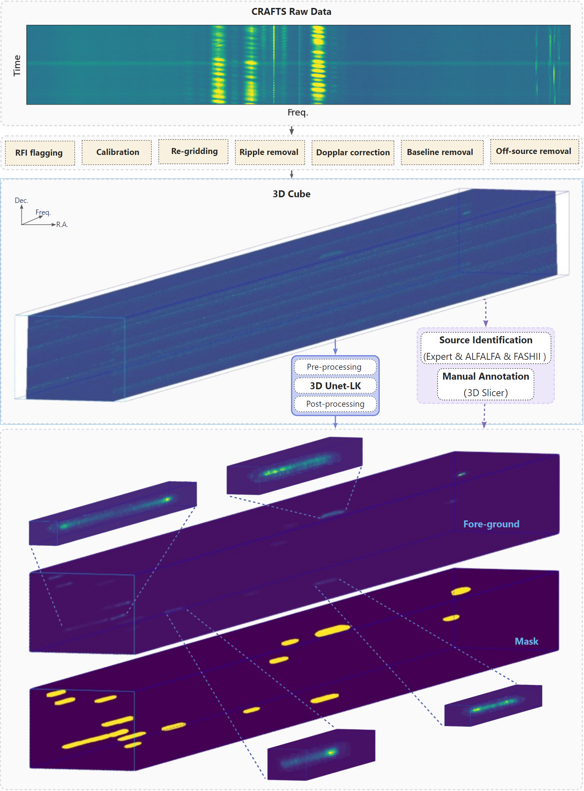

source code for 
# Automated Identification and Segmentation of hi Sources in CRAFTS Using Deep Learning Method

## Abstract
We introduce a machine learning-based method for extracting HI sources from 3D spectral data, and construct a dedicated dataset of HI sources from CRAFTS. Our custom dataset provides comprehensive resources for HI source detection. Utilizing the 3D-Unet segmentation architecture, our method reliably identifies and segments HI sources, achieving notable performance metrics with recall rates reaching 91.6\% and accuracy levels at 95.7\%. These outcomes substantiate the value of our custom dataset and the efficacy of our proposed network in identifying \hi source.

## Model Pipeline

